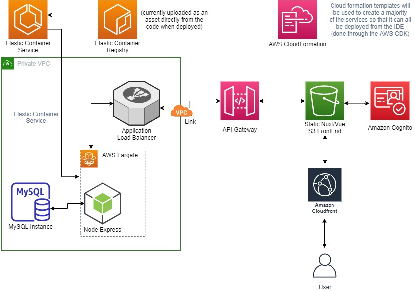

## Graduating April 2023

## Hello! 😄

Thanks for visting my github! I am a passionate Software Developer and a Master of Information Systems Management graduate from Brigham Young University.

### What interests me?
I love developing scalable Full Stack projects using cloud computing services such as Amazon Web Services (see content under "Dreamjob" for more). I am always excited to learn new technologies and utilize them to solve problems. I work hard to fully understand the topics I am tackling, rather than just doing enough to get by.

### What do I value?
> Educating the mind without educating the heart is no education at all.
> -- Aristotle

As I strive to be successful, my goal is to always be mindful of my peers. It has been my experience that individuals who can empathize with others are not only more likely to succeed, but help others to succeed as well.

# My Projects

## Dreamjob - Full-stack project using AWS, Node.js, and Vuetify/Vue.js

Click to expand!

### Summary:
Over the summer of 2021, I architectured and developed a full-stack project to increase my skills in a variety of areas. This has culminated in the "dreamjob" project, which is a web app that allows the user to save jobs on the website, as well as make a "timeline" of their career using those jobs to visualize how their career could look like. The webapp is optimized for both desktop and mobile (with more extensive testing done on Windows and iOS).

### The Stack:
Each stack is deployed individually using the AWS CDK in a "deploy" folder.

**Front-end**: HTML, CSS, JavaScript, Vue.js, Vuetify

**Back-end**: Node.js running on a docker container connected to a MySQL database (Objection.js was used as an ORM for a "model-first" approach to the database)

**Infrastructure**: Built on AWS. Almost all of the infrastructure was developed using the Typescript AWS CDK.

- S3/Cloudfront (For static hosting of the site)
- Cognito (For registering users)
- ECS/Fargate (For the Node.js container)
- Application Load Balancer (To handle load balancing for the fargate tasks)
- API Gateway (To enable calls to endpoints on the backend container)
- VPC (For separating services into public and private subnets)
- Amazon RDS (For the MySQL database)
- Other miscellaneous services to support the stack (Secrets Manager, Lambda, etc.)
  
### Infrastructure Diagram
  

  
Click to reveal!

    
A high level overview of the infrastructure supporting the web application.

    
  

### Related Repos:

- Frontend: https://github.com/justintlaw/dreamjob
- API: https://github.com/justintlaw/dreamjob-api
- Database: https://github.com/justintlaw/dreamjob-db

## Pokedex - iOS Application using Swift 4, UIKit, and Storyboard

Click to expand!

### Summary:
Over a winter break during school, I developed a "Pokedex" application that is completely usable offline. The application allows the user to browse a list of 151 pokemon, search the list, tap on a pokemon to see more details, as well as the ability to search a list of moves for each pokemon. In order to gather the data, I wrote a python script to pull data from the pokeapi, and in the same script saved the data to a SQLite database for use in the iOS application (that script was not saved to this repo, unfortunately).
  
**Repo**: https://github.com/justintlaw/Pokedex

## Game Project - AWS Lambda/API Gateway service implementing a CI/CD pipeline

  
Click to expand!

  
  ### Summary:
  This was a short project that I completed over a few days in Fall 2021. It's main purpose was to learn how to implement a basic CI/CD pipeline through AWS. As time permits, more may be added such as automated testing of the API in the CI/CD pipeline. The API is written in Node.js and uses a DynamoDB table as the database. Infrastructure was written as code using the AWS CDK.
  
**Repo**: https://github.com/justintlaw/game-project

<!--
**justintlaw/justintlaw** is a ✨ _special_ ✨ repository because its `README.md` (this file) appears on your GitHub profile.

Here are some ideas to get you started:

- 🔭 I’m currently working on ...
- 🌱 I’m currently learning ...
- 👯 I’m looking to collaborate on ...
- 🤔 I’m looking for help with ...
- 💬 Ask me about ...
- 📫 How to reach me: ...
- 😄 Pronouns: ...
- ⚡ Fun fact: ...
-->
